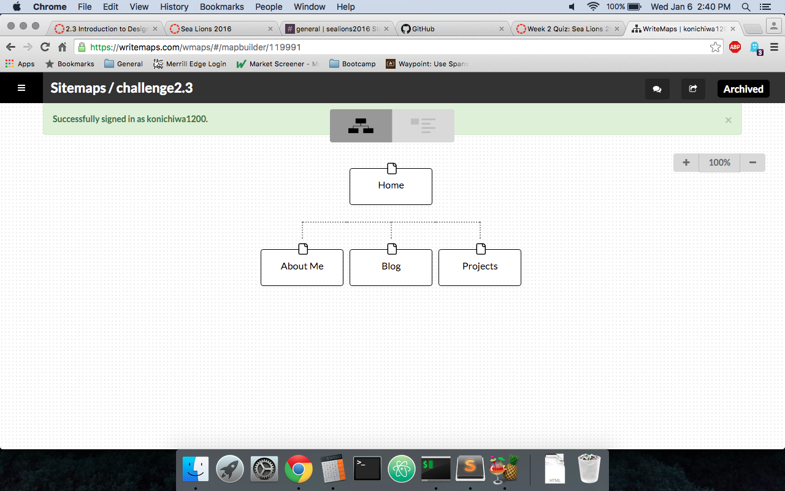

---
###What are the 6 Phases of Web Design?
They are:
1. Reconnaissance
2. Planning
3. Design
4. Development
5. Test and Delivery
6. Maintenance

---
###What is your site's primary goal or purpose? What kind of content will your site feature?
A billboard about myself, and it will be advertising my skills. Like an art gallary, it will present my projects ranging in complexity and with a unified theme, hopefully. It will also contain a blog, something like an open mic night at a local comedy club.

---
###What is your target audience's interests and how do you see your site addressing them?
The target audience will probably be interested in the quality of the project, and how elegant it will be. Something like the red carpet at the Oscar's or Golden Globe Awards. Every designer has its product being displayed, and everyone analyzes it based on quality, craftsmanship, and personal preference. Like mentioned above, I want to present a coherent theme on the website while showcasing the diverse skills and present the most radical or innovative persectives front and center.

---
###What is the primary "action" the user should take when coming to your site? Do you want them to search for information, contact you, or see your portfolio? It's ok to have several actions at once, or different actions for different kinds of visitors.
I want to present my projects to be front and center with a small non-intrusive button on the corner or bottom for the contact, and maybe a small bio that would give insight into the flow or inspiration of my projects. 

---
###What are the main things someone should know about design and user experience?
Design is about bringing different materials and methods together to construct a product, just like an architect things of different materials and ways to put them together to complete their vision. Its all about solving a problem and being creative.

UX is about navigating or using the product. Its about the people that will live or use the building, in my example above, and how practical or functional it is. The functionality rests on the target audience which will be complemented by the design. That is, the design is the solution to the problem, and the UX is the polish and other finishing touches. 

---
###What is user experience design and why is it valuable? 
UX design is the interaction between product and user, and the ease of such use. Its value is determined by the effectiveness of the product to produce efficiencies for the problem its trying to solve.

For example, the personal website for this challange which will be refined as we proceed forward in the course will be an adversement, and thus the UX design will be showcasing my projects. Its value will be based on how effective it can be to convince people that I am a web developer. 

---
###Which parts of the challenge did you find tedious?
Finding the words to describe the end goal of something that is sometimes trivial. Its like describing how to whistle to somebody.

--- 