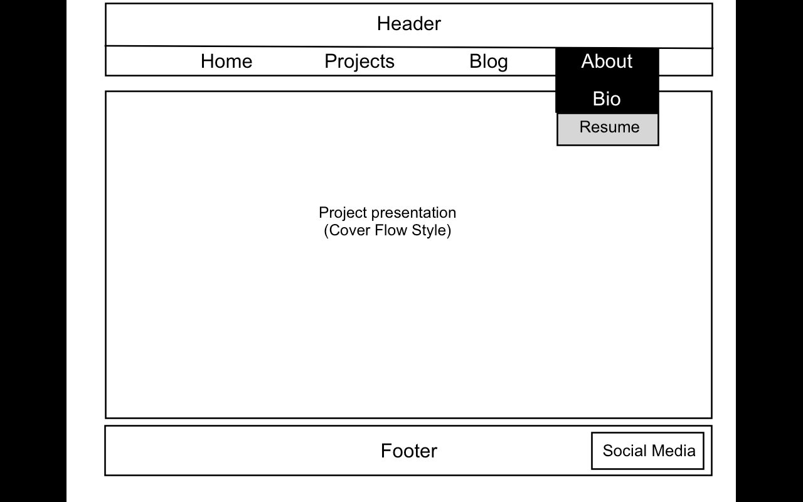
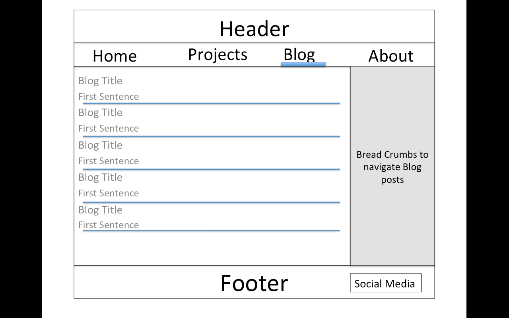

---

---
###What is a wireframe?
Technique used to provide the general idea of the webside. Its like a blueprint written on the back of a napkin.

---
###What are the benefits of wireframing?
It gives the developer a rough sketch of how to proceed with the development.

---
###Did you enjoy wireframing your site?
No, it was like a process that I had to do. Just like writting an outline for a paper in college, it was necessary but not enjoyable.

---
###Did you revise your wireframe or stick with your first idea?
One draft only. But I think that as the development process begins, the wireframe could be malleable and adapt to any modifications that surface.

---
###What questions did you ask during this challenge? What resources did you find to help you answer them?
Main question was how to create the draft and that was based solely on the website that went through the process in detail.

---
###Which parts of the challenge did you enjoy and which parts did you find tedious?
The tedious part was finding the right program to do the wireframe, because Mac does not have a good paint equivalent, that was just frustrating. But like stated above, the joy will actually come from taking the code and portraying the wireframe vision.