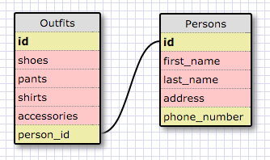

##RELEASE 5
1. Select all data for all states.
 - `SELECT * FROM states;`

2. Select all data for all regions
 - `SELECT * FROM regions;`

3. Select the `state_name` and `population` for all states
 - `SELECT state_name, population FROM states;`

4. Select the `state_name` and `population` for all states ordered by population. The state with the highest population should be at the top
 - `SELECT state_name, population FROM states ORDER BY population DESC;`

5. Select the `state_name` for the states in region 7
 - `SELECT state_name FROM states WHERE region_id = 7;`

6. Select the `state_name` and `population_density` for states with a population density over 50 orderd from least to most dense
 - `SELECT state_name, population_density FROM states WHERE population_density > 50 ORDER BY population_density ASC;`

7. Select the `state_name` for states with a population between 1 million and 1.5 million people
 - `select state_name from states where population > 1000000 and population < 1500000;`

8. Select the `state_name` and `region_id` for states ordered by region in ascending order
 - `SELECT state_name, region_id FROM states ORDER BY region_id ASC;`

9. Select the `region_name` for the regions with "Central" in the name
 - `SELECT region_name FROM regions WHERE region_name LIKE "%Central";`

10. Select the `region_name` and the `state_name` for all states and regions in ascending order by `region_id`. Refer to the region by name. (This will involve joining the tables)
 - `SELECT region_name, state_name FROM regions JOIN states ON regions.id = states.region_id;`

##RELEASE 6
####Schema Diagram

##RELEASE 7
What are databases for?
- Data management tools

What is a one-to-many relationship?
- One primary key can have many associations. For example, location to sports teams would be a one to many relationship; San Francisco can have more many sports teams, but there is only one San Francisco, CA(city).

What is a primary key? What is a foreign key? How can you determine which is which?
- Primary key uniquely identifies a record in the database. It can be any data type, but most often its an integer.
- Foreign key is a primary key in a different table
- There can't be any duplicate values in a primary key, therefore, if the table has a duplicate values, it must be the foreign key. 

How can you select information out of a SQL database? What are some general guidelines for that?
- General formula: "what to do" + "what to get" + "from where" + "optional things to do to the result" + ;
   - `function to perform` followed by `fields to return` followed by `where to find the fields` followed by `filter/organize results` followed by `;`
   - Example: `SELECT * FROM states WHERE state_name LIKE "C%";`  