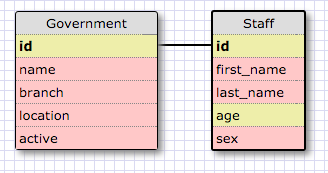
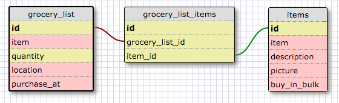

##RELEASE 2: One to One Schema

This is a one-to-one relationship because there can be only one person working for the government that has the exact credentials for that position. Essentially, the information on both tables can be combined into one, but we separate it because it would have too much information if we wanted to share the table. 

##RELEASE 4: Refactor
 

##RELEASE 6: Reflect
What is a one-to-one database?

- One record in one table has one and only one relationship to a record of another table   

When would you use a one-to-one database? (Think generally, not in terms of the example you created).

- When there is a table with many fields, but that there is a need to share the table, then any information that does not need to be shared/or viewed to accomplish the task can be removed and converted to another table and link it through a one-to-one relationship

What is a many-to-many database?

-   When the data stored in a table has connections within itself. That is, that if all of the data were to be stored in a flat file, we could find redundancy within the table at many locations. Example would be music artists. In a flat file, we can store the artist name and info, albums and their info, publishing house and their info, among other things. All of this information can be stored in a single table but there would be lots of redundant information, plus a publishing house will have many artists, and an artist can have more than one publishing house. Also, artist might have more than one album, and that album might be recorded by more than one artist, and so on. Many to many connections. 

When would you use a many-to-many database? (Think generally, not in terms of the example you created).

-   See above.

What is confusing about database schemas? What makes sense?

- The general concept of databases is natural, especially since I have seen them in action using the little known program of MS Access. The real confussion part is when to use SQL vs NoSQL, why? Is there a rule of thumb? Is it easier to future proof vs restructure down the road? Additionally, should SQL be the focus or Postgres and why? So more questions on the implementation vs questions about the theoretical side.
